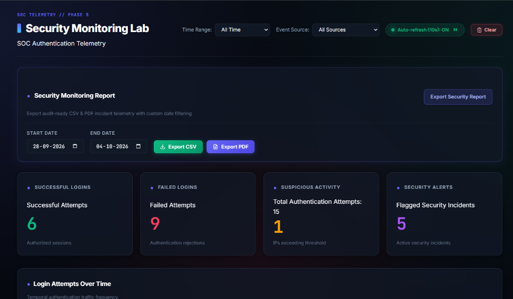
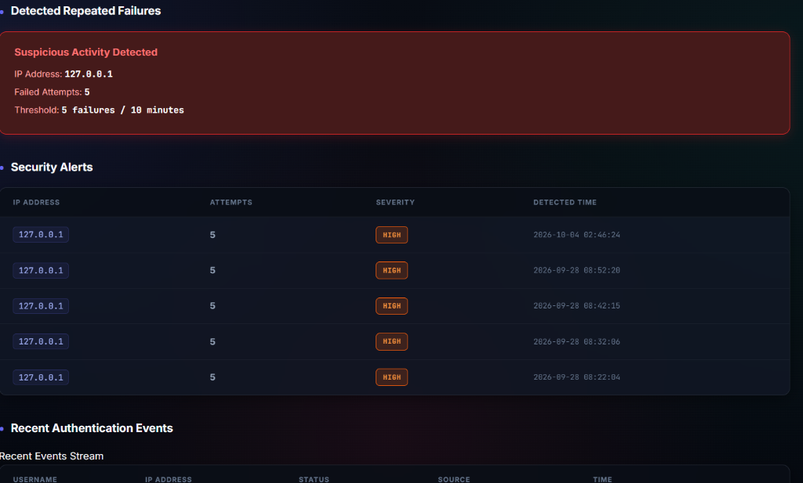
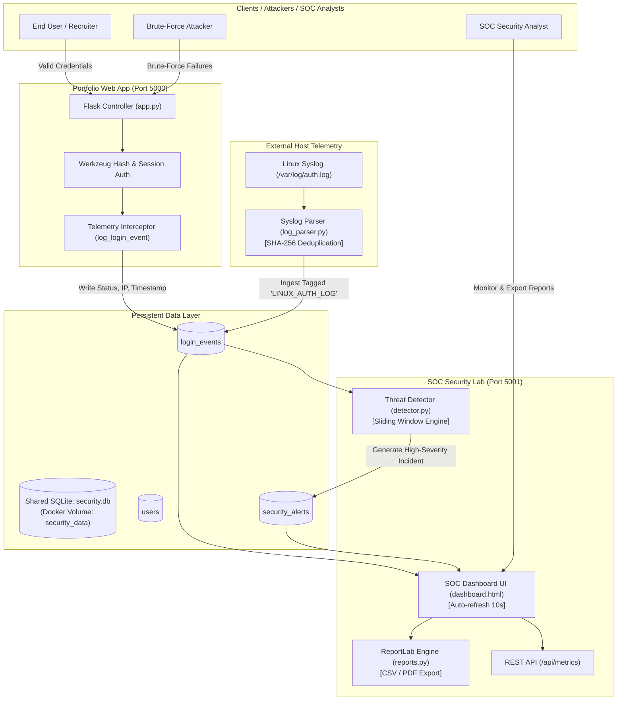

# 🛡️ Cybersecurity SOC Platform & Authentication Telemetry Lab

<div align="center">

[](https://www.python.org/)
[](https://flask.palletsprojects.com/)
[](https://www.sqlite.org/)
[](https://www.docker.com/)
[](LICENSE)
[](https://github.com/krishnacbadiger2005-prog/cybersecurity-soc-platform)

**An enterprise-grade, dual-service Cyber Defense & Security Operations Center (SOC) telemetry platform.**  
Seamlessly pairs a production-hardened web application with an automated threat-detection engine, Linux syslog ingestor, and live incident monitoring dashboard.

[Live Features](#-key-features) • [Screenshots](#-soc-dashboard-preview) • [Quickstart](#-quickstart-guide) • [Architecture](#-system-architecture) • [API Reference](#-rest-telemetry-api) • [Testing](#-test-verification)

</div>

---

## 📸 SOC Dashboard Preview

### 1. Executive Telemetry Overview & Incident Metrics
Live single-pane-of-glass dashboard displaying real-time authentication volume, authorized sessions, rejections, threshold-violating attacking IPs, auto-refresh polling (10s), time-range/source filtering, and executive audit report generators (CSV & PDF).

<div align="center">
  
</div>

<br/>

### 2. Automated Brute-Force Incident Alerting & Threat Correlation
Algorithmic detection flagging repeated authentication failures ($\ge 5$ attempts within a 10-minute sliding window). When triggered, the system generates real-time high-severity alerts, highlights the attacker's IP address, and correlates attempts across both web and Linux SSH telemetry.

<div align="center">
  
</div>

---

## 🌟 Key Features

| Capability | Technical Details |
| :--- | :--- |
| **Dual-Service Microarchitecture** | Completely separates user-facing traffic (`port 5000`) from internal SOC management and analyst telemetry (`port 5001`). |
| **Real-Time Telemetry Interception** | Non-blocking hooks record every login event (`SUCCESS` or `FAILED`), IP address, client headers, and timestamp into `login_events`. |
| **Heuristic Threat Detection Engine** | Dual-mode sliding window algorithm analyzing both live wall-clock streams and historical logs against brute-force attacks. |
| **Linux Syslog Ingestion Pipeline** | Ingests OpenSSH `/var/log/auth.log` records with deterministic SHA-256 fingerprinting for duplicate suppression and multi-source correlation. |
| **SOC Analytics Dashboard** | Real-time dark-mode GUI featuring 10-second polling, hourly traffic timelines, top attacking IPs leaderboard, and full audit logs. |
| **Multi-Format Audit Reporting** | Generates executive security audit reports in CSV and styled, publication-ready PDF formats via ReportLab. |
| **Cryptographic Hardening** | Salting and password derivation with PBKDF2/scrypt (`werkzeug.security`) and HMAC-signed session cookies. |
| **Containerized Orchestration** | Pre-configured `docker-compose.yml` leveraging shared named volumes (`security_data`) for inter-container SQLite synchronization. |

---

## 🏛️ System Architecture



---

## 🚀 Quickstart Guide

### Option A: Local Development (Two-Terminal Workflow)

#### 1. Environment Setup
```powershell
# Clone the repository
git clone https://github.com/krishnacbadiger2005-prog/cybersecurity-soc-platform.git
cd cybersecurity-soc-platform

# Activate Python Virtual Environment
.\.venv\Scripts\Activate.ps1

# Install project dependencies
pip install -r requirements.txt
pip install reportlab
```

#### 2. Terminal 1: Launch the Portfolio Application (Port 5000)
```powershell
python app.py
```
> 🌐 **App URL**: [http://127.0.0.1:5000](http://127.0.0.1:5000)  
> *Features registration, secure login, portfolio showcase, and session logout.*

#### 3. Terminal 2: Launch the SOC Security Lab (Port 5001)
```powershell
cd security-lab
python app.py
```
> 🛡️ **SOC Dashboard URL**: [http://127.0.0.1:5001/dashboard](http://127.0.0.1:5001/dashboard)  
> *Displays live metrics, telemetry timeline, alerts, and report export tools.*

---

### Option B: Docker Multi-Container Deployment

To spin up both microservices with shared volume persistent storage in a single command:

```bash
docker-compose up --build
```

- **Portfolio Application**: [http://localhost:5000](http://localhost:5000)
- **SOC Monitoring Lab**: [http://localhost:5001/dashboard](http://localhost:5001/dashboard)

To stop the containers:
```bash
docker-compose down
```

---

## 🔬 Simulating Cyber Attacks & Ingestion

### 1. Simulating a Web Brute-Force Attack
1. Navigate to [http://127.0.0.1:5000/login](http://127.0.0.1:5000/login).
2. Enter invalid credentials **5 or more times** in succession.
3. Switch over to the SOC Lab at [http://127.0.0.1:5001/dashboard](http://127.0.0.1:5001/dashboard).
4. Watch the dashboard instantly update:
   - **Failed Logins** count increments.
   - **Suspicious Activity Detected** banner turns red, flagging `127.0.0.1`.
   - A **High Severity Alert** is recorded into `security_alerts`.

### 2. Ingesting Linux Syslog SSH Authentication Records
Run the built-in parser to process OpenSSH system logs:
```powershell
python security-lab\log_parser.py
```
- Extracts IPv4 addresses, usernames, and authentication outcomes.
- Applies SHA-256 fingerprinting: `SHA-256(source | timestamp | username | ip | status)`.
- Re-running the parser automatically skips duplicate logs, ensuring idempotency.

---

## 📊 Executive Security Reporting

The platform includes an automated reporting suite for security audits:

- **Audit-Ready CSV Export**:
  ```text
  GET /export-report?format=csv&start_date=YYYY-MM-DD&end_date=YYYY-MM-DD
  ```
  Includes high-level statistical KPIs followed by row-level incident event streams.

- **Executive PDF Export (ReportLab)**:
  ```text
  GET /export-report?format=pdf&start_date=YYYY-MM-DD&end_date=YYYY-MM-DD
  ```
  Generates a styled, publication-ready PDF audit dossier complete with severity color highlights and summary tables.

---

## 💻 CLI Database Inspector Utility

Inspect database records without requiring an external SQLite GUI tool:

```powershell
python view_db.py              # Display database summary & table statistics
python view_db.py users        # View registered accounts and password hashes
python view_db.py events       # View raw telemetry login events
python view_db.py metrics      # View real-time calculated SOC KPI metrics
python view_db.py query "SQL"  # Execute custom analytical SQL queries
```

---

## 📡 REST Telemetry API

Integration endpoint for SIEM forwarders, health probes, or external dashboards:

### `GET /api/metrics`
**Query Parameters**:
- `range`: `15m`, `1h`, `24h`, `7d`, `all` (default: `all`)
- `source`: `all`, `portfolio`, `linux` (default: `all`)

**Sample JSON Response**:
```json
{
  "total_attempts": 15,
  "successful_logins": 6,
  "failed_logins": 9,
  "suspicious_activity": 1,
  "security_alerts": 5,
  "current_range": "all",
  "current_source": "all",
  "top_source_ips": [
    { "ip_address": "127.0.0.1", "attempts": 9 }
  ],
  "alerts": [
    {
      "ip_address": "127.0.0.1",
      "attempt_count": 5,
      "severity": "HIGH",
      "timestamp": "2026-10-04 02:46:24"
    }
  ]
}
```

---

## 🧪 Test Verification

Run the automated test suites covering the entire platform:

```powershell
# Run all test suites
python -m unittest discover -s . -p "test_*.py"

# Unit & integration testing modules
python -m unittest test_app.py                  # Portfolio Auth & Session Tests
python -m unittest test_security_lab.py         # SOC Lab Queries & Reporting Tests
python -m unittest test_phase7_linux_parser.py  # Syslog Parser & Hash Deduplication Tests
```

---

## 📂 Repository Structure

```text
├── docker-compose.yml              # Multi-container orchestration (portfolio + security-lab)
├── requirements.txt                # Root dependencies
├── security.db                     # Shared SQLite database file
├── view_db.py                      # CLI tool to inspect DB tables, users, and audit logs
├── docs/screenshots/               # High-resolution dashboard screenshots
│
├── portfolio-app/                  # Microservice 1: Portfolio Web Application
│   ├── app.py                      # Flask routes (login, register, portfolio)
│   ├── database.py                 # Telemetry logger & DB connector
│   ├── requirements.txt            # Application dependencies
│   ├── Dockerfile                  # Container definition for port 5000
│   ├── static/style.css            # Dark cyber theme styling
│   └── templates/                  # Jinja2 templates (login, register, portfolio)
│
├── security-lab/                   # Microservice 2: SOC Security Operations Center
│   ├── app.py                      # SOC Dashboard server & REST API
│   ├── database.py                 # Telemetry analytical queries & alert store
│   ├── detector.py                 # Sliding-window brute force detection engine
│   ├── log_parser.py               # Linux syslog / SSH auth log parser & deduplicator
│   ├── reports.py                  # ReportLab PDF & CSV security audit generator
│   ├── Dockerfile                  # Container definition for port 5001
│   ├── sample_logs/auth.log        # Sample Linux syslog file for testing
│   ├── static/style.css            # SOC dashboard cyber styling
│   └── templates/dashboard.html    # Full SOC dashboard UI
│
├── test_app.py                     # Integration tests for Portfolio app
├── test_security_lab.py            # Unit & integration tests for Security Lab
└── test_phase7_linux_parser.py     # Test suite for Linux syslog parsing & deduplication
```

---

## 👤 Author

**Krishna C Badiger**  
*Cybersecurity Specialist & Software Engineer*  
- GitHub: [@krishnacbadiger2005-prog](https://github.com/krishnacbadiger2005-prog)

---

## 📄 License

This project is licensed under the [MIT License](LICENSE) — feel free to use and adapt for educational and portfolio demonstration purposes.
